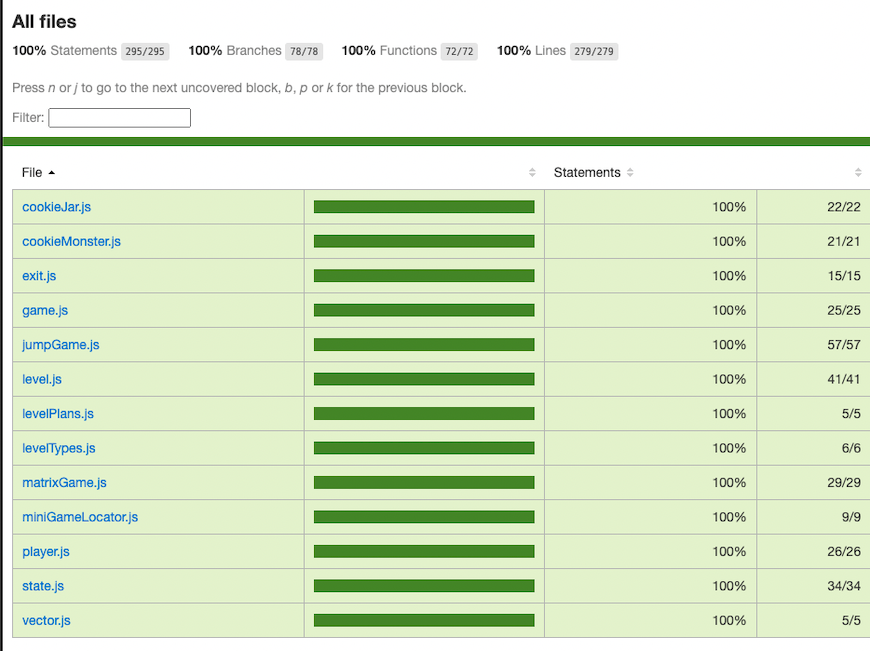
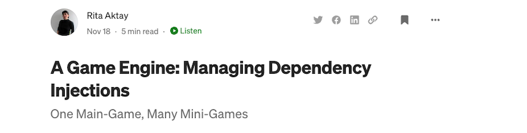

# A Game of Games

### ▶️ [PLAY](https://cookie-monster-game-of-games.herokuapp.com/)

- A front-end game that runs in the browser - move around with your keyboard to win mini games and escape the cookie monster!
- Built with vanilla JavaScript, HTML and CSS on a custom game engine. 
  
- [Read a blog post on how I designed a solution for this game engine with dependency injections](https://medium.com/@rita.aktay/a-game-engine-building-a-dependency-injection-container-27905b2a10ff)


### Code Coverage



### [Read More](https://medium.com/@rita.aktay/a-game-engine-building-a-dependency-injection-container-27905b2a10ff)



### Setup

- Clone repository

```sh
git clone https://github.com/ritaaktay/squid-game.git
```

- Install dependencies

```sh
npm install
```

- Run tests

```sh
npm test
```

- Bundle

```sh
npm run build
```

- Start server

```sh
npm run start
```

- View app in browser

```
http://localhost:8080/
```

- Check test coverage

```sh
http://localhost:8080/coverage/lcov-report/index.html
```

### Credits

- The implementation of our game and custom game engine was based on Marijn Haverbeke's tutorials in Chapter 16 of his book [Eloquent Javascript](https://eloquentjavascript.net/16_game.html)
