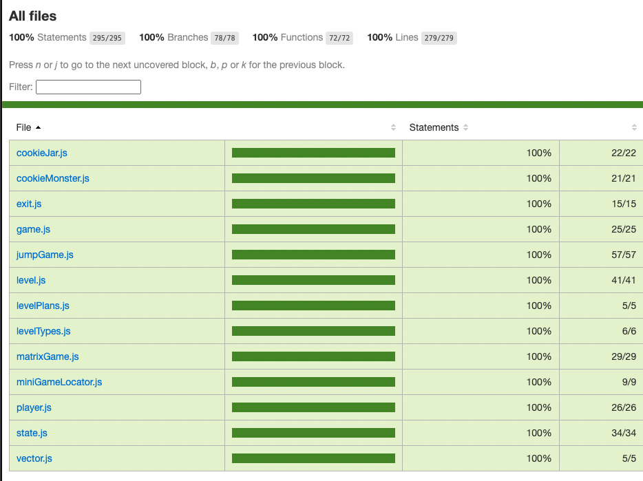

# A Game of Games

- A front-end game that runs in the browser - move around with your keyboard to win mini games and escape the cookie monster!
- Built with vanilla JavaScript, HTML and CSS on a custom game engine.


### Credits

- The implementation of our game and custom game engine was based on Marijn Haverbeke's tutorials in Chapter 16 of his book [Eloquent Javascript](https://eloquentjavascript.net/16_game.html)
- The source code for one of our mini games is from Max Teaches Tech (@codewmax)

### Setup

- Clone repository

```sh
git clone https://github.com/ritaaktay/squid-game.git
```

- Install dependencies

```sh
npm install
```

- Bundle app

```sh
npm run build
```

- Start server

```sh
npm run start
```

- View app in browser

```
http://localhost:8080/
```

- Run tests

```sh
npm test
```

### Code Coverage


